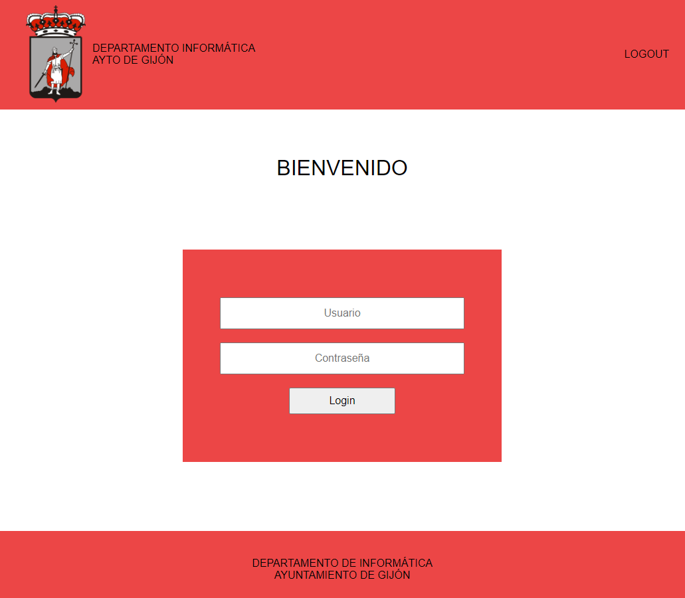
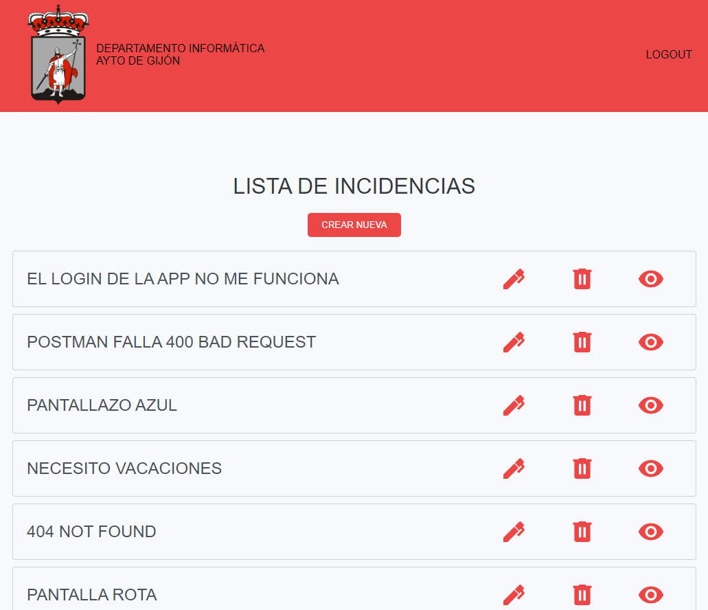
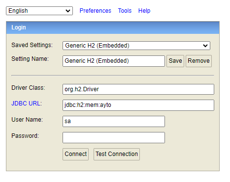
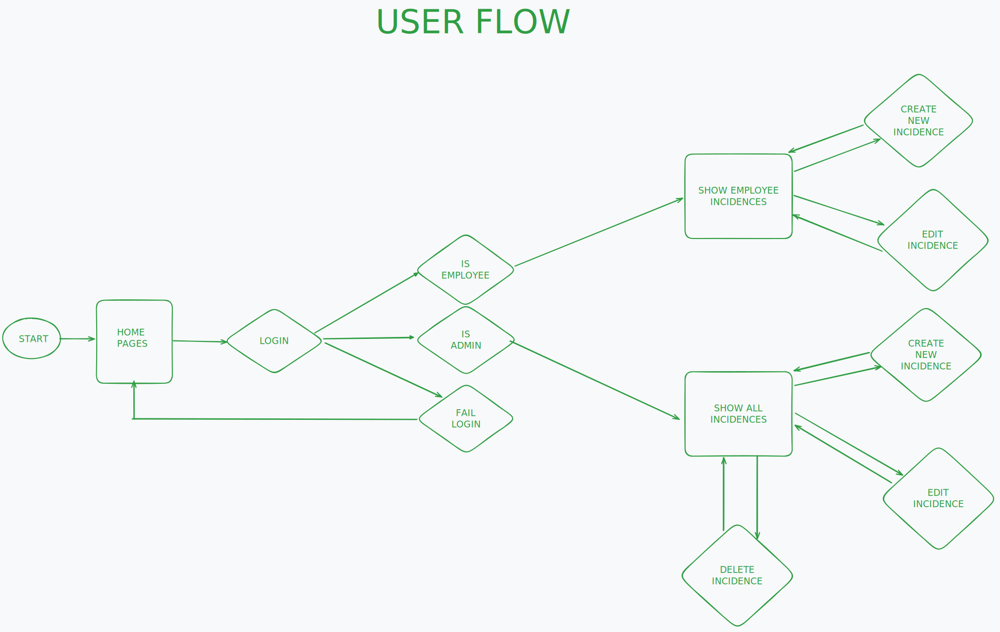
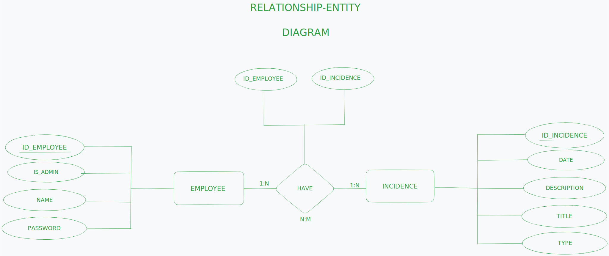

# AytoDesk - Support App

## Descripción del proyecto

Este proyecto se centra en el desarrollo de una API REST en el backend utilizando Spring Boot, destinada a gestionar usuarios e incidencias. La API incluye endpoints específicos para la manipulación de datos relacionados con usuarios y la gestión de incidencias asociadas.

Por otor lado, de frontend se utilizo VUE para crear la interfaz de usuario el cual interactua con el backend.




## Recursos

El proyecto esta creado con las siguientes tecnologías,

| Plugin               | URL                       |
| -------------------- | ------------------------- |
| Spring Web           | https://start.spring.io/  |
| Spring Data JPA      | https://start.spring.io/  |
| H2 Database          | https://start.spring.io/  |
| Spring BootDev Tools | https://start.spring.io/  |
| VITE + VUE           | https://vitejs.dev/guide/ |
| PINIA                | https://pinia.vuejs.org/  |
| SASS                 | https://sass-lang.com/    |

## Instalación del proyecto

Clonar el repositorio

```sh
https://github.com/BarmanDev/Support-App.git
```

Iniciar frontend

```sh
npm install
```

Compilar para desarrollo

```sh
npm run dev
```

Compilar para producción

```sh
npm run build
```

Ejecutar test unitarios

```sh
npm run test:unit
```

Iniciar backend

```sh
mvn spring-boot:run
```

Acceso a la base de datos H2 mediante URL:

```sh
url: http://http://localhost:8080/h2-console/
user: sa
password:
```



## Uso en Postman

### endpoints Employee

#### GET Employee

```sh
http://localhost:8080/api/v1/employee
```

#### POST (crear Employee)

```sh
http://localhost:8080/api/v1/employee
```

Hay que insertar un JSON para esta petición.

```json
{
  "name": "NombreEmpleado",
  "password": "ContraseñaEmpleado",
  "isAdmin": 0,
  "incidences": []
}
```

#### POST (editar Employee)

```sh
http://localhost:8080/api/v1/employee/editEmployee/1
```

Hay que insertar un JSON para esta petición.

```json
{
  "name": "hola",
  "password": "NuevaContraseña",
  "isAdmin": 1,
  "incidences": []
}
```

#### DELETE Employee

```sh
http://localhost:8080/api/v1/employee/deleteEmployee/1
```

### endpoints Incidence

#### GET Incidence

```sh
http://localhost:8080/api/v1/incidence/1
```

#### POST (crear Incidence)

```sh
http://localhost:8080/api/v1/employee
```

Hay que insertar un JSON para esta petición.

```json
{
  "titleIncidence": "No tengo ratón",
  "despriptionIncidence": "Llegué al puesto de trabajo y no tengo ratón",
  "typeIncidence": "Hardware",
  "dateIncidence": "31/12/2023"
}
```

#### POST (editar Incidence)

```sh
http://localhost:8080/api/v1/incidence/editIncidence/1
```

Hay que insertar un JSON para esta petición.

```json
{
  "idIncidence": 1,
  "titleIncidence": "EL LOGIN DE LA APP NO ME FUNCIONA",
  "despriptionIncidence": "NO TENGO RATÓN ME LO ROBARON",
  "typeIncidence": "HARDWARE",
  "dateIncidence": "2024-01-08"
}
```

#### DELETE Incidence

```sh
http://localhost:8080/api/v1/incidence/deleteIncidence/1
```

## USER FLOW



## DIAGRMA ENTIDAD RELACIÓN



## MODELO BASE DE DATOS


